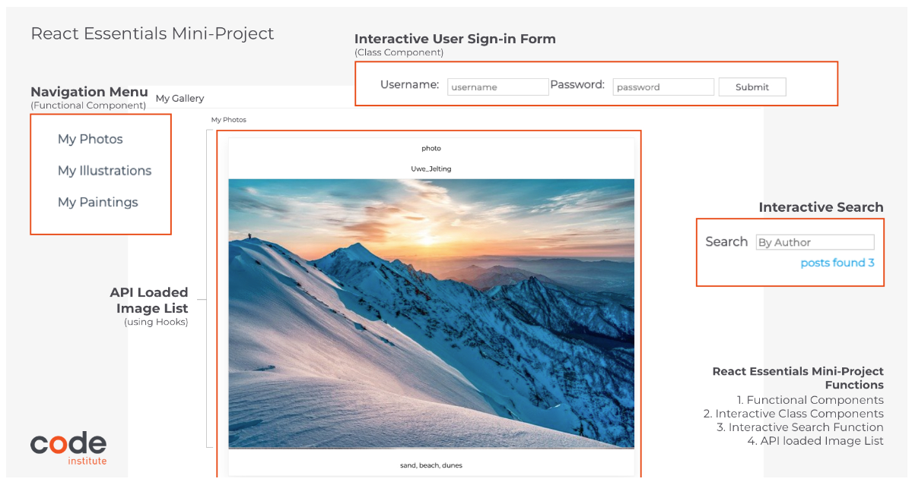
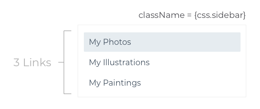
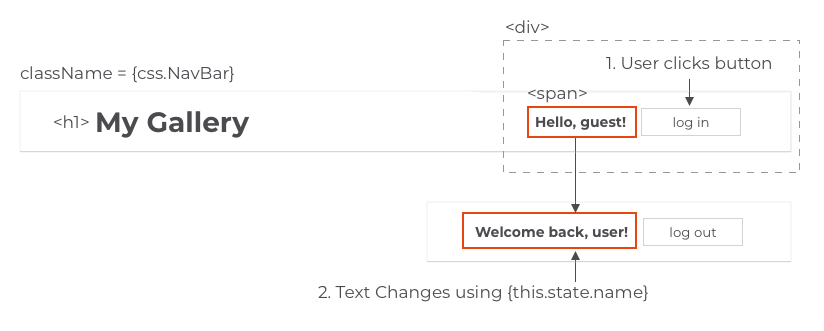

# React Components


---
## Introduction to React components

A component represents the part of user interface. Components are reusable and can be used in anywhere in user interface.

Two main types of components in React:
* stateless functional components
* stateful class components

Building components is the crux of everything we'll do in React, since after all, **a React application is nothing  more than a collection of components composed together to create a user interface**.

Reference: [React Functional Components VS Class Components](https://articles.wesionary.team/react-functional-components-vs-class-components-86a2d2821a22)

---
## Two Main Types of Components in React
In the react-components folder, there are three components:
* FunctionalGreetings
* StatefulGreetings
* HooksCounter

Each component is written in its own JavaScript file so it can be reused as needed, and is capitalized using PascalCase so that React can tell it apart from standard HTML elements in the JSX.

**1. Stateless Functional Components (aka Functional Components, aka Stateless Components)**
* just a JavaScript function that returns the HTML we see on the preview window
* the standard is for a component like this to <u>take a parameter</u> called **props** (short of **properties**) and <u>return html(JSX)</u>
* the **props** parameter contains the properties that determine exactly what the component should *display* (a process known as *rendering*)
* gives solution withour using state
* can be typically defined using **arrow functions** but can also be created using a regular **function** keyword

    **Where does the actual name (in FunctionalGreeting.js) come from?**
    `{props.name}` <br/>

    It comes from the **name** attribute (in **App.js**) which is specified whenever we include the component. Using this prop, we can use this component to render a greeting for any name we wish. **The important thing  to remember about stateless functional components is that once they're rendered with their props, their output will always remain the same.**
<br/>
<br/>

**2. Stateful Class Components (and understanding the StatefulGreeting.js code)**
* While stateless functional components always remain the same once they're rendered, **stateful class components have the ability to change** by using the **state** (just a JavaScript object containing various properties).
* The initial state (the values the state has the first time the component renders) is defined in the constructor method:
    ```javascript
    constructor(props) {
        super(props);
        this.state = {
        count: 0
        };
    }
    ```
    ❗In this example the initial **state** provides the component with a **state property** called *count*, which is initialized to zero. These state properties can be accessed within the component by accessing **this.state**, and can be changed at will by simply updating their state.

    There are all sorts of things that can cause the state to be updated, but most often, it's a user interaction.

    ```javascript
    setCount = () => {
        this.setState(prevState => {
        return { count: prevState.count + 1 }
        })
    }
    ```
    In the example above, when we click the button to increment the count, the setCount method is called which increments the count by one and then rerenders the component with a new state containing the new count. Refreshing the preview window resets the count back to zero, as defined in the initial state, inside the constructor method.

* Stateful components can also take props, just like a functional component.

## React Hooks (and understanding HooksCounter.js code)

A **hook** is a built in React function that we can <u>add to a stateless functional component which will allow it to behave like a stateful component</u>.

* a functional component example
    ```javascript
    import React from "react";

    export default function FunctionalGreeting(props) {
        return (
            <div className="greeting">
                <h1>Hello, {props.name}!</h1>
                <h2>I'm a simple functional component!</h2>
            </div>
        );
    }
    ```
* a hook function example
    ```javascript
    import React, { useState } from "react";

    export default function HooksCounter(props) {
    // count: a new state property
    // setCount: a method to update count
    // useState(0): initialize count to 0
    const [count, setCount] = useState(0);

        return (
            <div className="greeting">
            <h1>Hello {props.name}! I'm a functional component with hooks!</h1>
            <h2>You clicked {count} times</h2>
            <button onClick={() => setCount(count => count + 1)}>Increment Counter</button>
            </div>
        );
    }
    ```

Normally, because this is a functional component, it wouldn't be able to have any sort of interactivity.
Since it's just a function, without hooks it doesn't have a state and so the button wouldn't be able to do anything at all, because there wouldn't be anything to change.

If we wanted to be able to display this **count** and **allow the button to update it**, we'd need to use a stateful class component like the one we just looked at.

However, through the use of the **useState** hook, we can give this functional component a state.
* The hook allows us to create a state property called count
* create a method to update it called setCount
* provide it an initial value of zero, and,
* then call the method when the button is clicked

It accomplishes the exact same thing as the stateful component with a lot less code.

In modern React, functional components using hooks are increasingly being used as a replacement for stateful components. Using hooks enable us to:
* accomplish the same things and more while using less code
* avoid the complexities of the **this** keyword
* eliminate the need to worry about the constructor (See **2. Stateful Class Components** above)

---
## Summary
* We use stateless functional components for components that are simple and do not need to change.
* We use stateful class components for components requiring interactivity.
* We use hooks to enable stateless functional components to behave like stateful class components, but with a lot less complexity.

---
Next: **Writing functional component from scratch and learning more about how props work**

----

## Project Brief

### Project Description
As part of your React journey, you've been hired by a client to develop a frontend portfolio website using React.


**Learning Objectives**
1. Create a *Navigation Menu*
2. Create a *User Sign In form* displaying different content based on user interactions
3. Create an *API-Loaded Image List* complete with title, author and description text
4. Create an *Interactive Search Field*

---
## Introduction to Functional Components
**Project objective 1:** use React to build a simple side bar containing 3 anchor elements to other pages.


**Learning Objectives**
To complete this task, you will need to learn more about:
1. What is a *Functional Component*? When are they used?
2. How to add *Props* to your components?

---
Next: **Open [First React App](https://github.com/JoyZadan/first-react-app)**

---
## Introduction to Class Components

**Project Description:**
In this section, you will need to use React to build an **Interactive Navbar** containing:

1. Sign in Button: Simple Button which changes the value of the welcome message.
2. Logo Text: e.g. My Gallery
3. Welcome Message: This message changes value when the users click the button.


**Learning Objectives**
1. What is a *Class Component*? When are they used?
2. How to add *State* to your components?
3. How to change a component's *State*

---