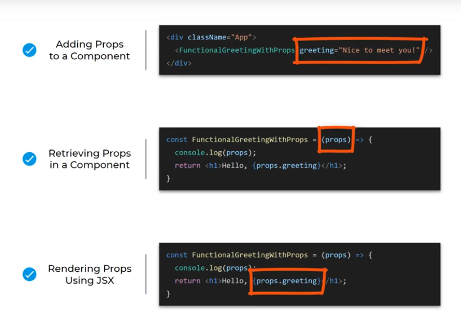
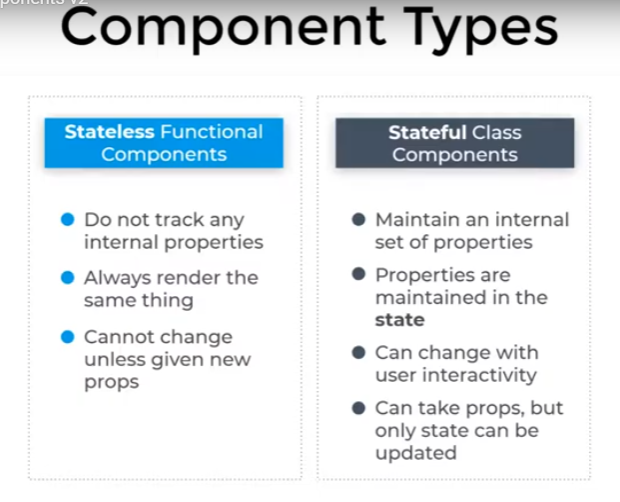
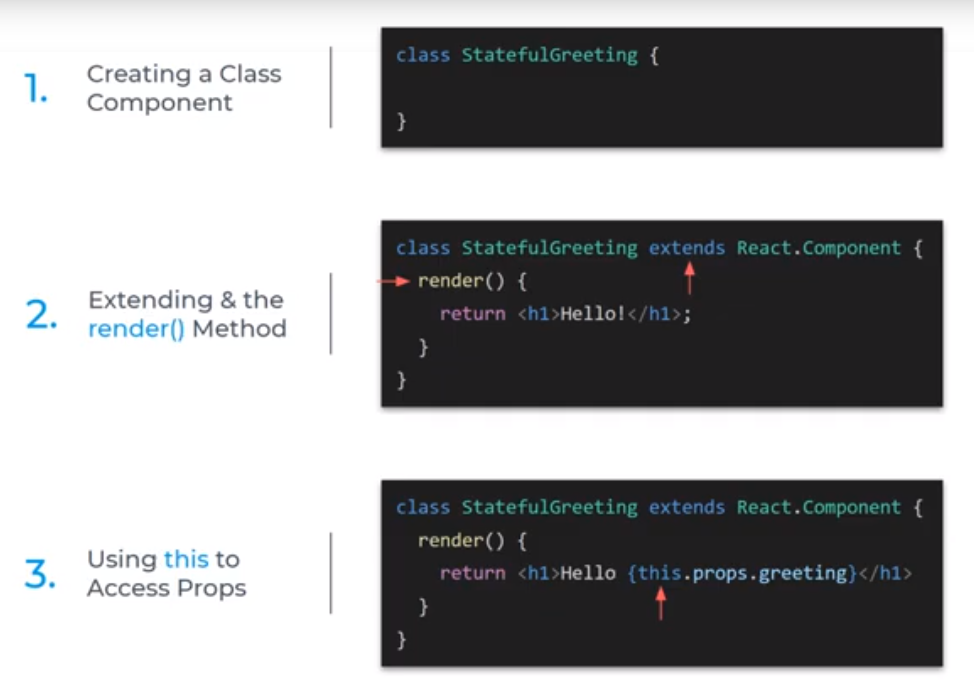

# React Components


---
## Introduction to React components

A component represents the part of user interface. Components are reusable and can be used in anywhere in user interface.

Two main types of components in React:
* stateless functional components
* stateful class components

Building components is the crux of everything we'll do in React, since after all, **a React application is nothing  more than a collection of components composed together to create a user interface**.

Reference: [React Functional Components VS Class Components](https://articles.wesionary.team/react-functional-components-vs-class-components-86a2d2821a22)

---
## Two Main Types of Components in React
In the react-components folder, there are three components:
* FunctionalGreetings
* StatefulGreetings
* HooksCounter

Each component is written in its own JavaScript file so it can be reused as needed, and is capitalized using PascalCase so that React can tell it apart from standard HTML elements in the JSX.

**1. Stateless Functional Components (aka Functional Components, aka Stateless Components)**
* just a JavaScript function that returns the HTML we see on the preview window
* the standard is for a component like this to <u>take a parameter</u> called **props** (short of **properties**) and <u>return html(JSX)</u>
* the **props** parameter contains the properties that determine exactly what the component should *display* (a process known as *rendering*)
* gives solution withour using state
* can be typically defined using **arrow functions** but can also be created using a regular **function** keyword

    **Where does the actual name (in FunctionalGreeting.js) come from?**
    `{props.name}` <br/>

    It comes from the **name** attribute (in **App.js**) which is specified whenever we include the component. Using this prop, we can use this component to render a greeting for any name we wish. **The important thing  to remember about stateless functional components is that once they're rendered with their props, their output will always remain the same.**
<br/>
<br/>

**2. Stateful Class Components (and understanding the StatefulGreeting.js code)**
* While stateless functional components always remain the same once they're rendered, **stateful class components have the ability to change** by using the **state** (just a JavaScript object containing various properties).
* The initial state (the values the state has the first time the component renders) is defined in the constructor method:
    ```javascript
    constructor(props) {
        super(props);
        this.state = {
        count: 0
        };
    }
    ```
    ❗In this example the initial **state** provides the component with a **state property** called *count*, which is initialized to zero. These state properties can be accessed within the component by accessing **this.state**, and can be changed at will by simply updating their state.

    There are all sorts of things that can cause the state to be updated, but most often, it's a user interaction.

    ```javascript
    setCount = () => {
        this.setState(prevState => {
        return { count: prevState.count + 1 }
        })
    }
    ```
    In the example above, when we click the button to increment the count, the setCount method is called which increments the count by one and then rerenders the component with a new state containing the new count. Refreshing the preview window resets the count back to zero, as defined in the initial state, inside the constructor method.

* Stateful components can also take props, just like a functional component.

## React Hooks (and understanding HooksCounter.js code)

A **hook** is a built in React function that we can <u>add to a stateless functional component which will allow it to behave like a stateful component</u>.

* a functional component example
    ```javascript
    import React from "react";

    export default function FunctionalGreeting(props) {
        return (
            <div className="greeting">
                <h1>Hello, {props.name}!</h1>
                <h2>I'm a simple functional component!</h2>
            </div>
        );
    }
    ```
* a hook function example
    ```javascript
    import React, { useState } from "react";

    export default function HooksCounter(props) {
    // count: a new state property
    // setCount: a method to update count
    // useState(0): initialize count to 0
    const [count, setCount] = useState(0);

        return (
            <div className="greeting">
            <h1>Hello {props.name}! I'm a functional component with hooks!</h1>
            <h2>You clicked {count} times</h2>
            <button onClick={() => setCount(count => count + 1)}>Increment Counter</button>
            </div>
        );
    }
    ```

Normally, because this is a functional component, it wouldn't be able to have any sort of interactivity.
Since it's just a function, without hooks it doesn't have a state and so the button wouldn't be able to do anything at all, because there wouldn't be anything to change.

If we wanted to be able to display this **count** and **allow the button to update it**, we'd need to use a stateful class component like the one we just looked at.

However, through the use of the **useState** hook, we can give this functional component a state.
* The hook allows us to create a state property called count
* create a method to update it called setCount
* provide it an initial value of zero, and,
* then call the method when the button is clicked

It accomplishes the exact same thing as the stateful component with a lot less code.

In modern React, functional components using hooks are increasingly being used as a replacement for stateful components. Using hooks enable us to:
* accomplish the same things and more while using less code
* avoid the complexities of the **this** keyword
* eliminate the need to worry about the constructor (See **2. Stateful Class Components** above)

---
## Summary
* We use stateless functional components for components that are simple and do not need to change.
* We use stateful class components for components requiring interactivity.
* We use hooks to enable stateless functional components to behave like stateful class components, but with a lot less complexity.

---
Next: **Writing functional component from scratch and learning more about how props work**

---
## Writing a Functional Component from scratch
Note: the App function is actually a functional component in itself
```javascript
function App()
```

### Steps:
1. Remove everything from App.js except:
    ```javascript
    import logo from './logo.svg';
    import './App.css';

    function App() {
        return (
            <div className="App">
                <h1>Test it works!</h1>
            </div>
        );
    }

    export default App;
    ```
2. Inside the **src** folder, create a folder called **components**

3. Inside this new **components** folder, create a file and call it **FunctionalGreeting.js** <br/> <u>(Note the use of PascalCase when naming the file. This is standard for naming React components and is required for our app to render correctly.)</u>

4. Import React from react
```javascript
import React from "react";
```

Note: this line gives us access to everything React itself can do, including calling `react.createElement` which is what JSX will use to create all the HTML elements this component will render.

Also note: This line is actually not required in the latest versions of React. Including this line makes our components backwards compatible with earlier versions of React.

5. Create a new function called FunctionalGreeting:
```javascript
function FunctionalGreeting(){
    return <h1>Hello from React!</h1>
}
```
Note: This is a valid functional component but it won't do anything until we include it in the rest of the application by:
* exporting the function from FunctionalGreeting.js:
    ```javascript
    export default FunctionalGreeting
    ```
* importing it where we want to use it, in this case, App.js
    ```javascript
    import FunctionalGreeting from "./components/FunctionalGreeting"
    ```
    * here we reference the file path where this function exists

❗This process of writing a component, exporting it, and then importing it into your main app file is the basis for how we create user interfaces in React. All your components for different parts of the UI will go into your main **App.js**, and  together they make up the whole user interface.

Note: Components that are totally independent and won't have any other content except what it renders itself do not need a closing tag. We just self-close it with a **space** and a **forward slash**. Most components can be rendered this way.
`<FunctionalGreeting /> ` <br/>
In more advanced apps, you'll definitely see components that wrap other components, so to close a component, close it like any other HTML element:
```javascript
<FunctionalGreeting>
    other stuff goes here
</FunctionalGreeting>
```

### Using arrow function to keep our code as modern as possible:
vanilla JS:
```javascript
function FunctionalGreeting() {
    greeting = () => "Hello from React";
}
```
converted to arrow function:
```javascript
const FunctionalGreeting = () => <h1>Hello from React!</h1>;
```

Note on the use of **default** (see line 89) when exporting our component: This is so when we import it, we can  actually do so using any name we want and are not required to import it as **FunctionalGreeting**, though it is convention to do so anyway. There is another alternative called **named exports**,  which we'll learn about as we become more advanced in React development.

---
### Summary
* We learned how to create our first stateless functional component from scratch
* We learned that we can reuse this component over and over simply by expoerting it into the file we wish to use it in.

---
Next: **Adding props to our stateless functional component**

---

## Adding props to our stateless functional component

**Props** (short for properties)
* they are specified as attributes to the component (just like you would specify any other HTML attribute such as class or ID)
* represent the parameters you pass into your React component
* to tell it what it renders
* and how

❗**Steps to Duplicating Components:**
1. Create a duplicate of the functional greeting component
2. Rename it to FunctionalGreetingWithProps
3. Inside the file, change the name of the function, and the name of the export to match
4. Go to App.js, import the FunctionalGreetingWithProps component
5. Then include it underneath the  regular functional greeting component

❗ **Adding a prop:** <br/>
1. In **App.js** file, add a prop called *greeting* and set its value to *Nice to meet you!*
```javascript
<FunctionalGreetingWithProps greeting="Nice to meet you!"/>
```
2. to actually use the new prop, we have to retrieve it in the **FunctionalGreetingWithProps.js** component, see below:
`(props)`

```javascript
const FunctionalGreetingWithProps = (props) => {
    return <h1>Hello! {props.greeting}</h1>;
}

```
3. render it as part of the JSX
`{props.greeting}`

❗<u>Any time  you want to use a prop, a JavaScript variable or any kind of JavaScript expression in your JSX, all you need to do is wrap it in {curly braces}.</u>




**Passing additional props to your component:**
* In the **App.js** file, separate the additional props using spaces:
    ```javascript
    <FunctionalGreetingWithProps greeting="Nice to meet you!" name="Mike" age="32" />
    ```

* In **FunctionalGreetingWithProps.js** component:
    ```javascript
    	const FunctionalGreetingWithProps = (props) => {
            console.log(props);
            return <h1>Hello, {props.name}! I see you're {props.age}; {props.greeting}! </h1>;
        }
    ```

[**Finished Source Code Repo**](https://github.com/Code-Institute-Solutions/gitpod-react/tree/b7e7da047b80911501e57d6dfb9ae090ad4c5dee/my-app/src)

---
## Project Brief

### Project Description
As part of your React journey, you've been hired by a client to develop a frontend portfolio website using React.


**Learning Objectives**
1. Create a *Navigation Menu*
2. Create a *User Sign In form* displaying different content based on user interactions
3. Create an *API-Loaded Image List* complete with title, author and description text
4. Create an *Interactive Search Field*

---
## Introduction to Functional Components
**Project objective 1:** use React to build a simple side bar containing 3 anchor elements to other pages.


**Learning Objectives**
To complete this task, you will need to learn more about:
1. What is a *Functional Component*? When are they used?
2. How to add *Props* to your components?

---
Next: **Open [First React App](https://github.com/JoyZadan/first-react-app)**

---
## Introduction to Class Components

**Project Description:**
In this section, you will need to use React to build an **Interactive Navbar** containing:

1. Sign in Button: Simple Button which changes the value of the welcome message.
2. Logo Text: e.g. My Gallery
3. Welcome Message: This message changes value when the users click the button.


**Learning Objectives**
1. What is a *Class Component*? When are they used?
2. How to add *State* to your components?
3. How to change a component's *State*

---
### Component Types
**Terminologies to remember**
* Stateless or Functional Components
* Stateful or Class Components

TABLE: Differences between Stateless Functional Components and Stateful Class Components

<br/>

❗ **StatefulGreeting.js** file: Extending the built-in Component class from React: <br/>
*OPTION ONE:*
```javascript
import React from "react";

// To turn this into a React component, we must extend the built-in Component class
// from React by adding 'extends React.Component' in the class definition
class StatefulGreeting extends React.Component {

}

export default StatefulGreeting;
```
*OPTION TWO:*
```javascript
// To turn this into a React component, we must extend the built-in Component class
// from React by adding importing {Component} directly from React at the top
// and extend just Component
import React {Component} from "react";

class StatefulGreeting extends Component {
    render() {
        return <h1>Hello from the Stateful Class Component!</h1>
    }
}

export default StatefulGreeting;
```

❗ **REMEMBER: Component names should always be PascalCase so React can tell them apart from regular HTML elements when we include them in our JSX and both React and Component must be capitalized to ensure we extend the class properly.**

NOTE: While functional components can simply return the JSX to be rendered, class components do not have the ability to return anything.
* We are still on **StatefulGreeting.js file**: all class components must define a render() method which returns the JSX (in this example, we're returning a greeting)
* Now, on **App.js** file:
    1. import the StatefulGreeting component
    2. include it in the top level App div
    ```javascript
        return (
            <StatefulGreeting />
        )
    ```
    3. duplicating the functionality of the FunctionalGreeting <u>with props</u> component
        * part 1: pass in a greeting prop with a value of *I'm a stateful class component*
        ```javascript (App.js)
        import StatefulGreeting from "./components/StatefulGreeting";

        function App() {
            return (
                <div className="App">
                    <!-- without using props -->
                    <!-- <StatefulGreeting /> -->

                    <!-- with props -->
                    <StatefulGreeting greeting="I'm a stateful class component" />
                </div>
            )
        }

        export default App;
        ```

        * part 2a: replace everything after *Hello* with `{props.greeting}`; but a **failed to compile, props is not defined** error will occur, because:
        * ❗part 2b: in order to access props in a stateful component, we need to refer to them as part of the class by using the **this** keyword by changing `{props.greeting}` to `{this.props.greeting}`

        ```javascript (StatefulGreeting.js)
        import React from "react";

        class StatefulGreeting extends React.Component {
            render() {
                <!-- return <h1>Hello from the stateful class component!</h1> -->
                return <h1>Hello {this.props.greeting}</h1>
            }
        }

        export default StatefulGreeting;
        ```

**SMALL CHALLENGE:**
As a small additional challenge, try adding a name prop to this component as well, and rendering it as part of the greeting.

Solution:
* on App.js, pass in a name prop with the value of "Joy", ie,  `name="Joy"`
* on StatefulGreeting.js, add the name prop and don't forget to refer to the new prop by using the *this* keyword, ie":
`return <h1>Hello, {this.props.name} {this.props.greeting}</h1>`

---
Next: **Why use Stateful Class Component? What is State?**

---
**Quick Review:** How to duplicate the functionality of a stateless functional component using stateful class component



---
## Class Components > What is 'State'?

First, recall that Stateful Class Components:
* have the ability to maintain their internal state which is a private, internal set of properties that:
    * describe what they display
    * and how they behave
<br/>

*Class components are able to change and update themselves at will or in response to user actions.*

### Adding State to your components

❗**constructor**:
* a special method that is always called when the class is first instantiated
* while *state* can be defined elsewhere, the *constructor* is where state is usually defined in class components
* to define the *state* in the constructor, we can simply define *this.state* and set it equal to an empty object, `{}`
* this means that as soon as this class is instantiated, it will automatically have a property called *state* which we can access and manipulate, as required.
* inside the constructor, the very first thing we must always do is to call the *super()* function
* this ensures that the constructor for the parent class, ie, React.Component, is also called
* it is also best practice to pass *props* to both the **constructor* method and the *super* function


    * in StatefulGreeting.js file:
    ```javascript
    import React from "react";

    class StatefulGreeting extends React.Component {

        constructor(props) {
            super(props);
            this.state = {};
        }

        render() {
            return <h1>Hello, {this.props.name}! {this.props.greeting}</h1>
        }
    }

    export default StatefulGreeting;
    ```

### ❗LEARNED STEPS SO FAR:
1. In your class component file, first *import React*
2. Instantiate *class*
3. Call the *constructor* method
4. Inside the *constructor*, call the *super* function
5. Below the *super* function, define the *state* in the constructor using the *this* keyword and set it to an empty object
6. It is best practice to pass *props* to both the *contructor* method and the *super* function

### Updating the State in response to user interactions
